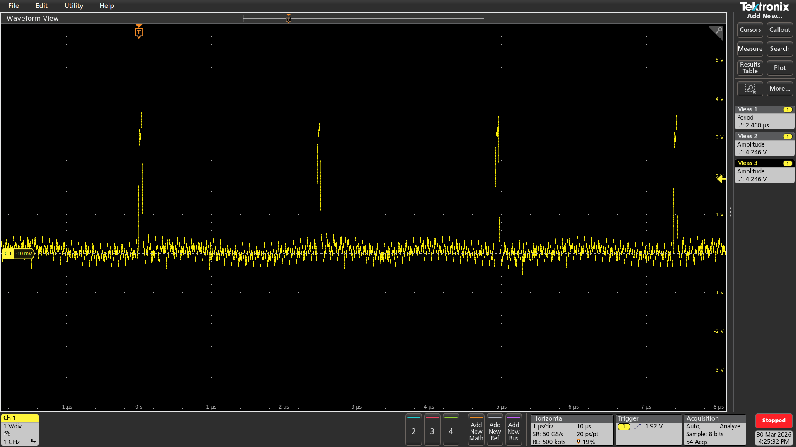
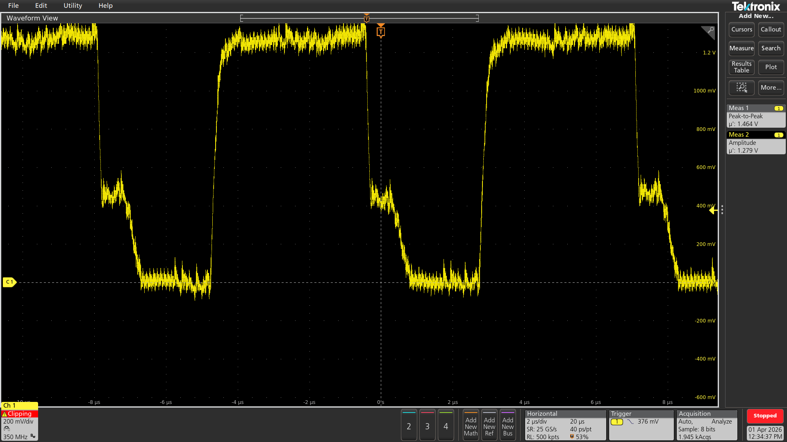

# FPGA-Based-LTC2662-DAC-Current-Control-System-Design-Using-SPI-with-LabVIEW-Software-Interface
# 🚀 LTC2662 DAC Control using SPI (FPGA / Verilog)

---

## 📖 Project Overview
This project focuses on the **design and implementation of an SPI-based control system for the LTC2662**, a high-current, multi-channel DAC. The system is implemented using **Verilog on FPGA**, enabling precise control of analog current outputs through digital commands.

The project not only covers **digital design (SPI, FSM, timing)** but also dives deep into **analog behavior, hardware validation, and real-world challenges** such as power limitations, noise, and measurement inaccuracies.

---

## 🎯 Objectives

The main objectives of this project are:

- Design a **robust SPI master controller** using Verilog  
- Interface FPGA with **LTC2662 DAC board**  
- Generate **programmable current outputs** using digital codes  
- Understand and implement **SPI Mode 0 timing accurately**  
- Verify communication using **Mixed Signal Oscilloscope (MSO)**  
- Validate output using:
  - Direct measurement (Multimeter)
  - Internal **MUX monitoring**
- Analyze **practical hardware challenges**:
  - Power limiting behavior
  - MUX inaccuracies
  - Effect of load resistance
  - Reference and FSADJ tuning

---

## 🧠 LTC2662 DAC – Detailed Introduction

The **LTC2662** is a **5-channel current source DAC** designed for high precision and high current applications.

### 🔑 Key Features
- 5 independent current output channels  
- Programmable current range:
  - 3.125 mA → 300 mA  
- Internal precision reference: **1.25V**  
- SPI interface (1.8V to 5V compatible)  
- Built-in **Analog MUX for monitoring**  
- Fault detection system:
  - Overtemperature
  - Open circuit
  - Power limit  

---

### ⚙️ Working Principle
- IOUT ∝ (VREF / RFSADJ)
  
- **VREF** → Internal or external reference  
- **RFSADJ** → Determines full-scale current  

Each channel has:
- Input register  
- DAC register  
- Programmable span (range)

---

### 🧩 Internal Architecture (Concept)

- SPI Shift Register  
- Command Decoder  
- Input Registers (A & B)  
- DAC Registers  
- Current Output Stage  
- Monitoring MUX  

---

## 🔌 Hardware Description

### 🟦 1. LTC2662 Evaluation Board
- Model: **DC2692A-A**
- Provides:
  - DAC chip
  - Power supply interface
  - Output terminals

#### Power Configuration:
- V+ = 15V  
- VDD0–VDD4 = 15V  
- VCC ≈ 5V (logic supply)

####  DAC Board Setup:

---

### 🟩 2. FPGA (SPI Master)
- Implements SPI protocol using Verilog  
- Generates:
  - SCLK  
  - MOSI  
  - CS  
  - LDAC  
  - CLR  

#### 📷 FPGA Setup:

---

### 🟨 3. Measurement Instruments

#### 🔹 MSO (Mixed Signal Oscilloscope)
- Used to verify:
  - SPI timing  
  - Clock frequency  
  - Data transfer  

#### 🔹 Multimeter
- Used for accurate current/voltage measurement  

####  SPI Waveform:

---

## 🔄 SPI Protocol – Detailed Explanation

### 🧭 SPI Mode 0 (Used in this Project)

SPI Mode 0 is defined as:
- **CPOL = 0 → Clock idle LOW**
- **CPHA = 0 → Data sampled on rising edge**

### 📌 Behavior:
- Data is **valid before rising edge**
- Data changes on **falling edge**
  ### SPI MODE 0 WAVEFROM

### MOSI DATA

### CS WAVEFROM

---

### ⏱ Timing Sequence

1. CS goes LOW → Communication starts  
2. Data shifted on MOSI  
3. Sampled on rising edge of SCLK  
4. After 24 bits → CS goes HIGH  
5. Command executes  

---

## ⚙️ Verilog Implementation

### 🔧 Features
- FSM-based SPI controller  
- Clock divider (10 MHz SPI clock)  
- Controlled timing (setup/hold compliance)  
- Packet-based communication  

---

### 🔄 FSM Flow
- IDLE → LOAD → CS_SETUP → TRANSFER → CS_HOLD → UPDATE → DONE
---

## 🧪 Experimental Setup

### Method 1: Direct Measurement
- Multimeter connected to output pin  

### Method 2: MUX Monitoring
- Internal MUX outputs voltage proportional to current  
- IOUT = IFS × (VMUX / VREF)

### Experimantal Setup 

---

## 📊 Results & Analysis

---

## 🚀 Advanced Implementations

### 🔁 1. MISO Readback Implementation

To enhance system reliability, **MISO (SDO) readback functionality** was implemented using the LTC2662 serial output pin.

- The DAC outputs previously transmitted data after **32 clock cycles delay**
- This enables **echo readback verification** of SPI communication
- Also allows monitoring of **Fault Register (FR bits)**

#### 🔍 Features:
- Verification of transmitted SPI packets  
- Detection of fault conditions:
  - Open circuit  
  - Overtemperature  
  - Power limit  
- Debugging support using oscilloscope  

   
  <em>SPI Communication with MISO Readback Verification</em>

---

### 🖥️ 2. GUI-Based DAC Control (LabVIEW + DAQ)

A **Graphical User Interface (GUI)** was developed using **LabVIEW** to control the DAC outputs in real-time.

#### ⚙️ System Integration:
- FPGA communicates DAC via SPI  
- **DAQ (Data Acquisition Device)** used as interface  
- LabVIEW GUI sends control signals via DAQ  

#### 🎯 Capabilities:
- Real-time current control  
- Dynamic parameter adjustment  
- Visual monitoring of DAC behavior  

#### 🧠 Working:
1. User inputs value on GUI  
2. DAQ transmits control signal  
3. FPGA processes and sends SPI command  
4. DAC updates output current  

   
  <em>LabVIEW GUI for Real-Time DAC Control</em>

---

### 📡 3. Multi-Channel Control

The LTC2662 supports **5 independent DAC channels**, and the system was extended to support:

- Simultaneous channel updates  
- Independent current control per channel  
- Efficient SPI command sequencing  

This allows:
- Parallel current output generation  
- Scalable system design  

---

### 📏 4. Calibration using MUX Monitoring

To improve accuracy, **calibration was performed using the internal MUX** of LTC2662.

#### 📐 Principle:

#### ⚙️ Process:
1. Select channel via MUX command  
2. Measure VMUX voltage  
3. Compare with theoretical value  
4. Apply correction factor  

#### 📊 Outcome:
- Improved accuracy  
- Reduced error due to:
  - Offset  
  - Gain variation  
  - Load effects  

   
  <em>Calibration and Debug Data using MUX Monitoring</em>

---

### 🧪 5. System-Level Integration

The complete system integrates:

- FPGA (SPI Master Controller)  
- LTC2662 DAC Board  
- DAQ Interface  
- LabVIEW GUI  

This creates a **closed-loop controllable analog system**, suitable for:

- Industrial control applications  
- Precision current driving  
- Embedded system prototyping  

   
  <em>Complete Experimental Setup</em>

---

## ⚠️ Challenges Encountered

### 🔴 1. MUX Monitoring Issue
- Accurate for normal loads  
- Inaccurate for very low resistance (e.g., 0.068Ω)  

**Reason:**
- High current causes non-ideal internal behavior  

---

### 🔴 2. FSADJ Resistor Effect
- Determines full-scale current  
- Internal: ~20kΩ  
- External resistor changes output range  

**Challenge:**
- Sensitive to noise and stray capacitance  

---

### 🔴 3. Power Limiting Issue
Condition:

Effect:
- Current automatically reduced (e.g., 200mA → 100mA)

**Solution:**
- Reduce supply voltage  

---

### 🔴 4. CLR Pin Behavior
- Active LOW reset  
- Clears all registers  

**Issue:**
- Improper handling resets DAC unexpectedly  

---

### 🔴 5. FAULT Pin
- Indicates:
  - Overtemperature  
  - Open circuit  
  - Power limit  

**Observation:**
- Useful for debugging hardware faults  

---

### 🔴 6. VCC and Supply Issues
- VCC must be stable (2.85V – 5.5V)  
- Improper supply causes:
  - Communication failure  
  - Incorrect output  

---

### 🔴 7. Noise & Wiring
- Loose connections → unstable readings  
- High current → heating effects  

---

## 🧩 Complete Workflow

1. Initialize FPGA  
2. Generate SPI clock  
3. Send:
   - Span command  
   - Data command  
4. Toggle LDAC  
5. Measure output  
6. Verify using MSO  
7. Analyze results  

---

## 📚 Key Learnings

- Real-world SPI debugging  
- DAC behavior under different loads  
- Importance of:
  - Proper grounding  
  - Supply stability  
  - Accurate measurement methods  

---

## 🚀 Future Improvements

- Implement **MISO readback**  
- Multi-channel simultaneous control  
- GUI-based DAC control  
- Calibration using MUX  

---

## 📎 References
- LTC2662 Datasheet (Analog Devices)  
- SPI Verilog Implementation  
- Hardware Experiment Observations  

---

## 👤 Author
**Nitya Maheshwari**  
Electronics & Communication Engineering  

---

The DAC converts digital input into output current using:
